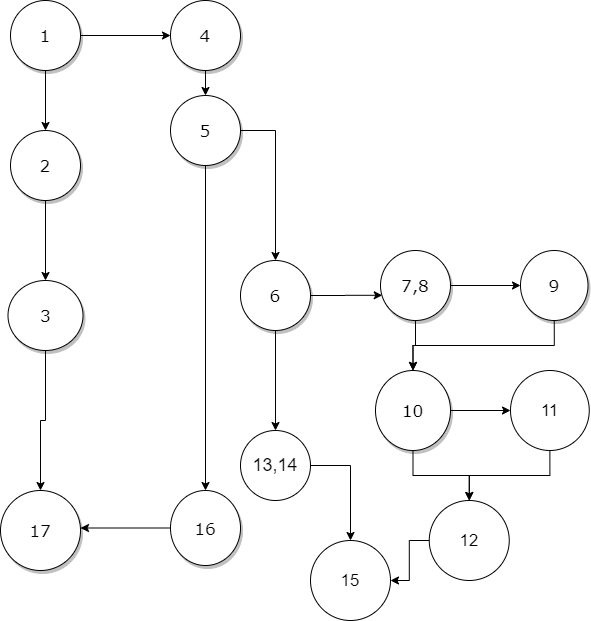

# Втора лабораториска вежба по предметот Софтверско Инженерство
# Љубомир Иванов, број на индекс 173173

### Група на код:
Ја добив групата на код 5

### Control Flow Graph


```java
public List<String> function(List<String> list) { // 1
        if (list.size() <= 0) { // 2
            throw new IllegalArgumentException("List length should be greater than 0");  // 3
        }
        List<String> numMines = new ArrayList<>(); // 4
        for (int i = 0; i < list.size(); i++) { // 5
            if (!list.get(i).equals("#")) { // 6
                int num = 0; // 7
                if (i - 1 >= 0 && list.get(i - 1).equals("#")) { // 8
                    num++; // 9
                }
                if (i + 1 < list.size() && list.get(i + 1).equals("#")) { // 10
                    num++; // 11
                }
                numMines.add(String.valueOf(num)); // 12
            } else { // 13
                numMines.add(list.get(i)); // 14
            }
        } // 15
        return numMines; // 16
    } // 17
```



### Цикломатска комплексност
Цикломатската комплексност на овој код е 6, истата ја добив преку формулата P+1, каде што P е бројот на предикатни јазли. Во случајoв P=5, па цикломатската комплексност изнесува 6.

### Тест случаи според Every path критериумот
```java
@Test
    void testEveryPath() {
        // 1, 2, 3, 17
        Exception ex = null;
        ex = assertThrows(IllegalArgumentException.class, () -> tester.function(new ArrayList<>()));
        assertTrue(ex.getMessage().contains("List length should be greater than 0"));
        // 1, 2, 4, 5, 16, 17 - не е возможно
        // 1, 2, 4, 5, (6, 13, 14, 15,), 16, 17
        assertEquals(createList("#"), tester.function(createList("#")));
        // 1, 2, 4, 5, ( 6, 7, 8, 10, 12, 15), 16, 17
        assertEquals(createList("0"), tester.function(createList("0")));
        // 1, 2, 4, 5, (6, 7, 8, 10, 12, 15), 6, 7, 8, 9, 10, 12, 15, 16, 17
        assertEquals(createList("#", "1"), tester.function(createList("#", "0")));
        // 1, 2, 4, 5, (6, 7, 8, 10, 12, 15), 6, 7, 8, 10, 11, 12, 15, 16, 17
        assertEquals(createList("1", "#"), tester.function(createList("0", "#")));
        // 1, 2, 4, 5, (6, 13, 14, 15), 6, 7, 8, 9, 10, 11, 12, 15, 16, 17 
        // 1, 2, 4, 5, (6, 13, 14, 15), 6, 7, 8, 9, 10, 11, 12, 15, (6, 13, 14, 15), 16, 17
        assertEquals(createList("#", "2", "#"), tester.function(createList("#", "0", "#")));
    }
```


### Објаснување на напишаните unit tests

### Every path<br>
Патеката 1, 2, 3, 17 фрла исклучок assertThrows. И тогаш имаме празна листа.<br>
Патеката 1, 2, 4, 5, 16, 17 не е возможен бидејќи ако има празна листа тогаш се очекува да се фрли исклучок.
Патеката 1, 2, 4, 5, (6, 13, 14, 15), 16, 17 Ако имаме само "#" во низата.<br>
Патеката 1, 2, 4, 5, (6, 7, 8, 10, 12, 15), 16, 17 Ако имаме само "0" во низата.<br>
Патеката 1, 2, 4, 5, (6, 7, 8, 10, 12, 15), 6, 7, 8, 9, 10, 12, 15, 16, 17 За наоѓање мини кои стојат пред празното поле.<br>
Патеката 1, 2, 4, 5, (6, 7, 8, 10, 12, 15,), 6, 7, 8, 10, 11, 12, 15, 16, 17 За наоѓање мини кои стојат после празното поле.<br>
Патеката 1, 2, 4, 5.1, ( 6, 13, 14, 15, ), 6, 7, 8, 9, 10, 11, 12, 15, 16, 17 Можно е да дојде до лупа ако имаме повеќе мини околу нас.<br>
Патеката 1, 2, 4, 5 ( 6, 13, 14, 15,) 6, 7, 8, 9, 10, 11, 12, 15, ( 6, 13, 14, 15), 16, 17 Да најдеме полесно мини околу нас.<br>

### Every branch<br>
За да го тестираме овој метод имаме 2 сличаја и првиот е со празна листа, додека вториот ги поминува сите гранки и ги маркира мините со 0,1 и 2.
